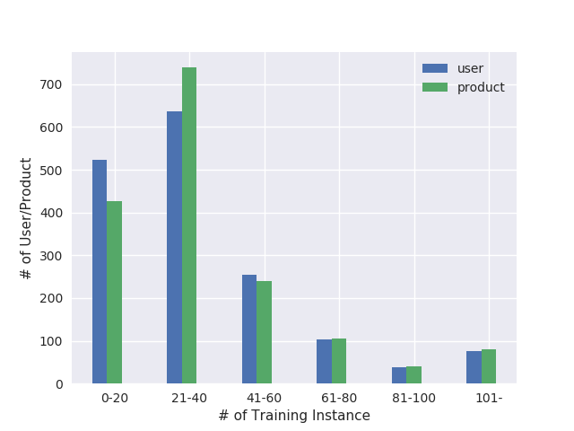
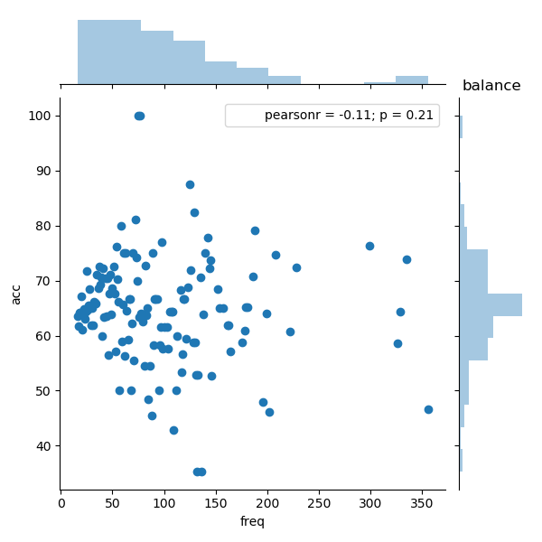
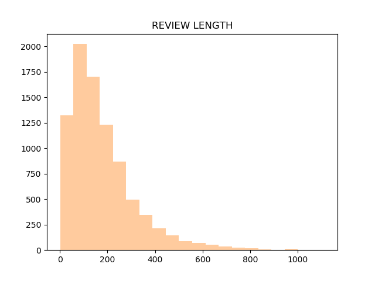
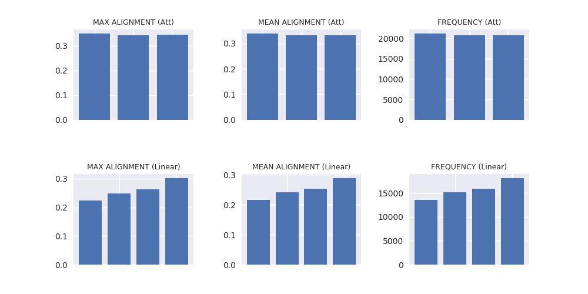
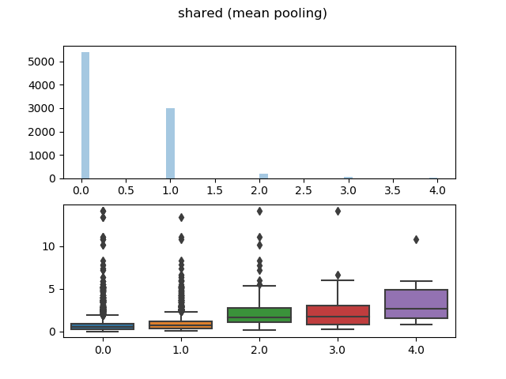

# Matplotlib and Seaborn
> libraries
~~~python
import numpy as np
import pandas as pd
import matplotlib.pyplot as plt
import seaborn as sns
sns.set()
~~~
> save image from remote client application
~~~python
import matplotlib.pyplot as plt
# plt.switch_backend('agg')
~~~

## 1. Bar chart

~~~python
h = [1,2,3,4,5,6]
plt.bar(
    x=np.arange(6), 
    height=h,
    tick_label=['0-20','21-40','41-60','61-80','81-100','101-'], 
    width=0.2,
    align='center',
    label='first bar chart')
plt.legend()
plt.xlabel('# of Training Instance')
plt.ylabel('# of User/Product')
# plt.show()
plt.gcf().savefig('Frequency_Distplot.png')
~~~

## 2. Scatter plot

~~~python
df = pd.DataFrame({'freq':[1,2,3], 'acc':[0.65,0.87,0.58]})
sns.jointplot(kind='scatter', data=df, x="freq", y="acc")
plt.title("first scatter plot")
plt.gcf().savefig("some_directory.png")
# plt.show()
plt.close()
~~~

## 3. Dist plot

~~~python
lens = [5,1,2,10,6,134,6,1,7,1,17,145,10,4,5,77,54,]
sns.distplot(lens, kde=False, bins=100).set_title("REVIEW LENGTH")
plt.gcf().savefig("REVIEW LENGTH.png")
plt.show()
plt.close()
~~~
## 4. Grid spec (with heatmap)

~~~python
import matplotlib.gridspec as gridspec
sns.set(font_scale=0.9)
gs0 = gridspec.GridSpec(x_size, y_size)    # (ny,nx)
plt.subplot(gs0[0:2, 0:sample_length+1])
plt.title("Attention Score")
ax = sns.heatmap(
		attention,
		vmin=0, vmax=1, 
		square=True, 
		annot=False,
		cbar=False,
		cmap="Blues", 
		linewidths=.5,
		xticklabels=True, 
		yticklabels=False
)
ax.set_xticklabels(
	labels=word_list, 
	rotation=45
)
plt.subplot(gs0[2:, 0:1])
plt.title("Attention Alignment")
ax = sns.heatmap(
		att_align, 
		vmin=0, vmax=1, 
		square=True, 
		cbar=False,
		cmap="Reds",  
		linewidths=.5,
		xticklabels=True, 
		yticklabels=True
)
ax.set_yticklabels(
	labels=["{:.2f}".format(x) for x in att_align.reshape(-1)], 
	rotation=0
)
ax.set_xticklabels(
	labels=[""], 
	rotation=0
)
plt.subplot(gs0[2:, -2:-1])
plt.title("Linear Alignment")
ax = sns.heatmap(
		linear_align, 
		vmin=0, vmax=1, 
		square=True, 
		cbar=False,
		cmap="Reds",  
		linewidths=.5,
		xticklabels=True, 
		yticklabels=True
)
ax.set_yticklabels(
	labels=["{:.2f}".format(x) for x in linear_align.reshape(-1)], 
	rotation=0
)
ax.set_xticklabels(
	labels=[""], 
	rotation=0
)
plt.gcf().savefig("some_directory.png"))
plt.show()
plt.close()
~~~
## 5. Box plot

~~~python
df = pd.DataFrame(
	{
	'DEV_RMSE':dev_prd_rmse,
	'TEST_RMSE':test_prd_rmse,
	'FREQUENCY':prd_freq,
	'CONSISTENCY':prd_cons,
	})
fig=plt.figure(1, figsize=(8, 8))
ax1 = fig.add_subplot(221)
ax2 = fig.add_subplot(222)
ax3 = fig.add_subplot(223)
ax4 = fig.add_subplot(224)
plt.suptitle("PRODUCT")
sns.set(font_scale=0.9)
gs0 = gridspec.GridSpec(9, 9)
sns.boxplot(x=df['DEV_RMSE'], y=df['FREQUENCY'], ax=ax1)
sns.boxplot(x=df['TEST_RMSE'], y=df['FREQUENCY'], ax=ax3)
sns.boxplot(x=df['DEV_RMSE'], y=df['CONSISTENCY'], ax=ax2)
sns.boxplot(x=df['TEST_RMSE'], y=df['CONSISTENCY'], ax=ax4)
plt.show()
plt.gcf().savefig(os.path.join('./analysis_result',"PRODUCT_rmse.png"))
plt.close()
~~~

~~~python
~~~
